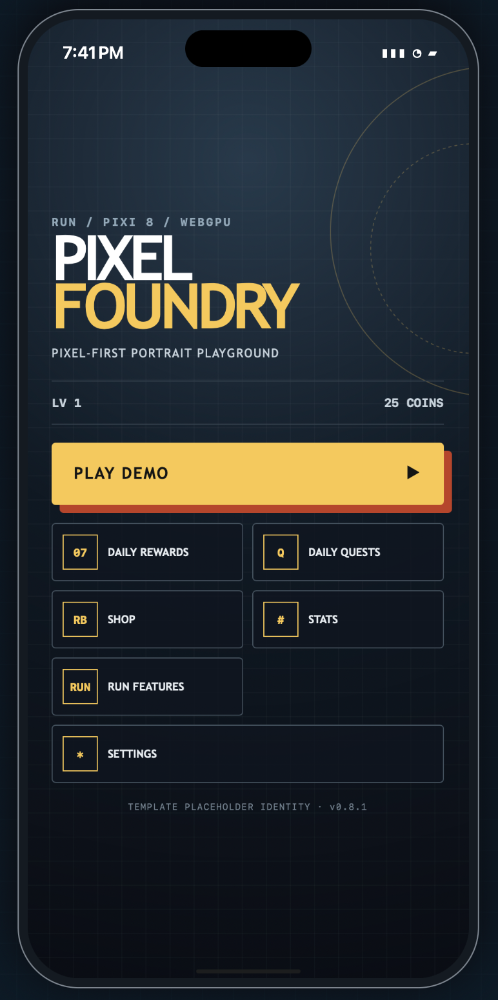

# RUN Pixi WebGPU template

## RUN.world CLI and SDK

This template uses two separate RUN.world tools. The **`rundot` CLI** is the
creator/operator tool used from a terminal to create, configure, test, deploy,
and operate games. The **RUN Game SDK** is the typed browser library imported by
the game to communicate with the RUN host while a player is playing. Never put
CLI credentials or creator-only operations in client code.

| Tool | Install | Where it lives | Audited version |
| --- | --- | --- | --- |
| `rundot` CLI | GitHub release installer below | Run `command -v rundot`; the macOS/Linux installer normally uses `~/.local/bin/rundot` | 7.10.0 |
| `@series-inc/rundot-game-sdk` | npm dependency below | `node_modules/@series-inc/rundot-game-sdk/` | 5.24.0 |

New to the platform? Begin with RUN’s official
[Getting Started guide](https://series-1.gitbook.io/rundot-docs/readme/getting-started),
or follow the guided
[Start building on RUN.world setup](https://events.run.world/events/cli-setup/).

### Install the `rundot` CLI

macOS or Linux:

```sh
curl -fsSL https://github.com/series-ai/rundot-cli-releases/releases/latest/download/install.sh | bash
```

Windows PowerShell:

```powershell
irm https://github.com/series-ai/rundot-cli-releases/releases/latest/download/install.ps1 | iex
```

Restart the terminal after installation, then verify or update it:

```sh
command -v rundot
rundot --version
rundot --help
rundot update
```

The usual first-project flow is:

```sh
rundot login       # authenticate the creator
rundot init        # create a RUN game and game.config.prod.json
npm run build      # produce ./dist
rundot deploy      # upload a new private/unlisted version by default
```

`rundot init` creates a remote game; `deploy`, data-management, generation,
LiveOps, marketing, moderation, and publishing commands can change remote state
or spend value. Inspect `rundot <command> --help`, the target game ID, and the
environment immediately before using them.

### Every CLI command group

This is every top-level group exposed by the installed CLI 7.10.0, including
hidden beta groups. Each group can have nested commands and version-specific
flags; use `rundot <command> --help` for the exhaustive current syntax. Set
`RUNDOT_BETA_FEATURES=1` only when a beta workflow is intentionally needed.

| Command | Purpose | Availability / risk |
| --- | --- | --- |
| `rundot update` | Update the CLI or change update channel | Changes local tooling |
| `rundot login` | Authenticate interactively or for headless CI | Never expose session material or API keys |
| `rundot migrate-config` | Move legacy configuration into `rundot/` | Review generated file changes |
| `rundot init` | Create a RUN game and local production config | Remote creation |
| `rundot deploy` | Upload a built game version | Remote release; public visibility requires explicit intent |
| `rundot list-games` | List games owned or editable by the creator | Read-only discovery |
| `rundot game` | Manage metadata, versions, tags, editors, keys, configs, builds, and 3D jobs | Mixed read/write/billed operations |
| `rundot analytics` | Query creator analytics and funnels | Visible beta; operational data may be sensitive |
| `rundot marketing` | Prepare and operate paid campaigns and creatives | Hidden beta; can spend money |
| `rundot socials` | Prepare and track organic launch packets | Hidden beta; can affect public-facing records |
| `rundot offerwall` | Internal offerwall administration | Internal-only; not for ordinary creator games |
| `rundot playground` | Manage scoped local Playground access | Keys are local secrets; purchases can be real |
| `rundot generate` | Estimate and generate images, sprites, audio, video, TTS, text, and workflows | Credit-billed generation |
| `rundot profile` | Inspect or search creator/player profiles | Primarily discovery |
| `rundot storage` | Inspect, export, import, or mutate player key/value storage | May expose or destructively change player data |
| `rundot assets` | List and manage generated creator/game assets | Removal can break consumers |
| `rundot files` | Manage player/creator files, quotas, visibility, and transforms | Durable data mutations |
| `rundot ugc` | Browse and moderate user-generated content | Hidden beta; privileged moderation |
| `rundot jam` | Discover, scaffold, and submit jam projects | Submission is an external mutation |
| `rundot skills` | Install or update RUN coding-agent skills | Changes local agent tooling |
| `rundot ai` | Configure RUN AI assistance for a coding agent | Review generated local changes |
| `rundot leaderboard` | Inspect scores, configuration, bans, and resets | Moderation/reset commands affect players |
| `rundot intel` | Access competitive market intelligence | Some downloads/generation are credit-priced |
| `rundot liveops` | Validate, diff, push, inspect, and roll back LiveOps config | Push/rollback changes live behavior |
| `rundot stats` | Inspect and manage player statistics | Hidden beta; writes affect player state |
| `rundot collectibles` | Inspect and manage collectible grants/catalogs | Hidden beta; writes affect player ownership |
| `rundot image` | Remove backgrounds, upscale, estimate depth, and create turnarounds | Hidden beta; prod-only billed utilities |
| `rundot credits` | Inspect credit balance and usage | Read-only until a billing/top-up action |
| `rundot pack` | Compile and submit deterministic native runtime packs | Validate locally before submission |

The repository’s safety-oriented command atlas is
[`docs/rundot-cli.md`](docs/rundot-cli.md). The installed SDK also ships the
official CLI manual at
`node_modules/@series-inc/rundot-game-sdk/docs/rundot-developer-platform/cli-reference.md`.

### Install and use the RUN Game SDK

This template already locks SDK 5.24.0, so `npm ci` installs the reviewed
version. In a new project, install the current package explicitly:

```sh
npm install @series-inc/rundot-game-sdk@latest
```

The package is downloaded into `node_modules/@series-inc/rundot-game-sdk/`.
Its bundled manuals are under `docs/`, its declarations are under `dist/`, and
its public package entry points are declared in its `package.json`. Scratch
projects can run `npx rundot-sdk-setup` to copy documentation and configure
agent files; this template is already configured and does not need that step.

Import the host-aware singleton in game code:

```ts
import RundotGameAPI from '@series-inc/rundot-game-sdk/api'

const profile = await RundotGameAPI.getProfile()
await RundotGameAPI.appStorage.setItem('save', serializedSave)
```

SDK 5.24 initializes on import. Do not add the deprecated manual
`initializeAsync()` call. Keep SDK calls behind a typed facade, capability-gate
host features, catch failures, and never simulate successful ads, purchases,
entitlements, scores, or privileged actions in local development.

The SDK provides APIs rather than terminal commands:

| Capability family | Installed SDK surfaces |
| --- | --- |
| Host and runtime | app/roles/launch intent, profile, system/device/environment, safe areas, gamepad, lifecycle, navigation, popups, preloader, trusted time, haptics |
| Persistence and assets | device/app/owner/shared storage, CDN, shared assets, files, clips, native video |
| Telemetry and configuration | analytics, funnels, logging, attribution, feature gates, LiveOps and experiments |
| Monetization and access | rewarded/interstitial ads, IAP, Shop, credits, entitlements, subscriptions, access gates |
| Progression and economy | leaderboards, stats, collectibles, simulation, large-number helpers |
| Player communication and content | notifications, inbox/RCS, social/share flows, UGC, collaboration, voting, moderation seams |
| Generation | text, image, sprite, audio/music/SFX/TTS, video, 3D, and avatar APIs |
| Multiplayer | realtime client plus `mp-server`, and deterministic Syncplay tooling |
| Privileged creator APIs | admin UGC and admin image/video/sprite/audio/3D generation; never expose these to ordinary players |

[`docs/run-capabilities.md`](docs/run-capabilities.md) maps every installed SDK
surface to an active demo or a typechecked adoption example. The main runtime
boundary is [`src/sdk/runSdk.ts`](src/sdk/runSdk.ts), while intentionally
excluded or privileged patterns live in
[`additional_features/`](additional_features/).

---

A small, production-minded portrait starter for 2D RUN.world games. The default
app is deliberately ordinary: React 19 UI, PixiJS 8 with WebGPU-first/WebGL
fallback, generated WebAudio, strict TypeScript, versioned saves, localization,
daily systems, and fail-closed RUN integrations.

<p align="center">
  
</p>

The repository also serves as a map of the wider RUN platform. Safe client
features are visible in the active demo behind explicit controls. Patterns that
can navigate away, spend value, mutate remote state, upload content, require
creator authority, or need a server build live under `additional_features/`;
they are typechecked but never imported by the default client bundle.

## Quick start

Node.js 22 or newer is required. Install the exact reviewed dependency graph
from the lockfile:

```sh
git clone https://github.com/LorenzGit/rundot_template-pixi-webgpu.git
cd rundot_template-pixi-webgpu
npm ci
npm run dev
```

Before adapting or publishing a derived game, run the complete verification
suite:

```sh
npm run check:all
```

Useful focused commands:

```sh
npm run typecheck          # active app and additional feature references
npm run format             # apply the repository formatter
npm run lint               # Biome correctness and accessibility lint
npm run check              # format, lint, tests, normal + bundled builds
npm run check:all          # check plus multiplayer + Syncplay builds
npm run build              # RUN embedded-library build
npm run build:bundled      # standalone fallback build
npm run dev:playground     # real RUN services; sign-in required
npm run dev:multiplayer    # local room server + client
npm run build:multiplayer  # emits the room server bundle
npm run build:syncplay     # strict determinism check
```

Playground is opt-in because it connects to persistent RUN data. Purchases made
there are real. Never buy, upload platform configuration, deploy, publish, or
run billed generation without the owner’s explicit approval.

`firebase` is an explicit, pinned dependency because RUN SDK 5.24 dynamically
imports its Playground authentication bridge without declaring the package as
a dependency. It is required for a resolvable production graph even though the
template never imports Firebase directly.

React and React DOM are also pinned to the exact versions in SDK 5.24's
embedded-library manifest. The build verifier fails if that optimization
silently stops working or if a generated JavaScript chunk exceeds 600 kB.
The npm install-script policy pins the reviewed SDK and esbuild scripts while
denying unnecessary Firebase, protobuf, and native fsevents install behavior.

## Repository map

| Path | Purpose |
| --- | --- |
| `.agents/skills/` | Project-local authoring skills copied with the template |
| `src/game/` | Pixi application, portrait stage, demo scene, particles, and tweens |
| `src/sdk/` | Capability-gated RUN facade and visible Feature Lab integration |
| `src/systems/` | Persistence, trusted time, localization, and daily systems |
| `src/ui/` | React-owned menus, HUD, settings, and platform demonstrations |
| `additional_features/` | Typechecked opt-in patterns excluded from the default client bundle |
| `docs/` | Platform, runtime, monetization, CLI, and audio contracts |
| `scripts/` | Template invariants and production-build verification |

## What is active

- Pixi 8 tries WebGPU device initialization and explicitly retries WebGL when
  that fails. `?renderer=webgpu` and
  `?renderer=webgl` force a backend for QA; the result is exposed as
  `document.documentElement.dataset.renderer`.
- A centered 9:16 portrait frame scales across phone, tablet, and desktop while
  RUN safe-area values feed CSS variables on every side.
- The procedural demo exercises sprite animation, tweens, particles, cleanup,
  reduced motion, quality scaling, lifecycle pause/resume, and generated audio.
- Versioned persistence validates untrusted save fields and serializes/coalesces
  RUN `appStorage` writes; plain local development has a visibly
  non-authoritative browser fallback.
- Daily rewards and quests use trusted RUN time in the host, stable claim IDs,
  duplicate/in-flight guards, atomic persistence, and rollback on save failure.
- LiveOps, custom/funnel analytics, notification consent/messaging, haptics, rewarded ads,
  Shop purchases, lifecycle hooks, and identity changes pass through one typed
  boundary in `src/sdk/runSdk.ts`.
- Monetization stays off until LiveOps, real IDs, host capability, direct player
  action, and authoritative outcomes all agree.
- The visible RUN Feature Lab exposes rewarded/interstitial ad tests, the native
  haptic palette, host/profile/system/gamepad/launch/attribution/time/feature
  discovery, native host UI, sign-in, add-to-home, player-service reads, sharing,
  clipboard writes, and all mapped SDK groups. Android back navigation closes
  the current game screen before delegating root exit to the host. Unsupported local calls report unavailable; they
  never simulate a successful host result.
- Procedural audio uses a quiet 68 BPM major-seventh motif with enveloped notes,
  cue cooldowns, separate Music/SFX controls, lifecycle suspension, and QA
  counters. Its direction is recorded in `docs/audio.md`.
- `?qa=1` installs a semantic `globalThis.__gameQa` contract in development
  only. Production builds do not expose it.

## Platform reference

- [`.agents/skills/rundot-multiplayer/`](.agents/skills/rundot-multiplayer/)
  is the source-driven multiplayer workflow. It routes authoritative realtime
  rooms, persistent worlds, seasons, deltas, shared economy, turns, transfers,
  PvP matchmaking, chat, server simulation, and deterministic SyncPlay to the
  target SDK's installed documents and declarations, with focused authority and
  verification references. It tracks RUN's official
  [Multiplayer API](https://series-1.gitbook.io/rundot-docs/readme/multiplayer)
  and
  [Advanced Multiplayer API](https://series-1.gitbook.io/rundot-docs/readme/advanced-multiplayer)
  without adding runtime code.
- [`.agents/skills/img2threejs/`](.agents/skills/img2threejs/) vendors
  [`hoainho/img2threejs`](https://github.com/hoainho/img2threejs) as an optional
  project-local authoring skill. It turns a suitable reference image into a
  quality-gated, code-only procedural Three.js model and includes the
  supporting `forge/` scripts and `grimoire/` rubrics. It is not part of the
  client bundle, does not add a runtime dependency, and does not make Three.js
  output directly renderable by Pixi; use it only when a derived project
  deliberately needs that workflow.
- [`docs/run-capabilities.md`](docs/run-capabilities.md) maps every SDK surface,
  what prior games taught the template, required authority, and its source.
- [`docs/rundot-cli.md`](docs/rundot-cli.md) is the CLI command/safety atlas.
- [`docs/social-k-factor.md`](docs/social-k-factor.md) explains how to make
  invitation, co-op, challenge, and relay loops feel like play while measuring
  K-factor honestly.
- [`docs/cpi-conscious-game-design.md`](docs/cpi-conscious-game-design.md)
  connects category, fantasy, art direction, ad creative, CPI, retention, and
  LTV without encouraging misleading acquisition creative.
- [`docs/audience-monetization-women-35-45.md`](docs/audience-monetization-women-35-45.md)
  is an ethical hybrid ads/IAP research brief for women aged 35–45, with
  behavior-first segmentation and testable offer hypotheses.
- [`additional_features/`](additional_features/) contains only the typechecked
  patterns intentionally excluded from the default demo, including camera,
  microphone, simulation, and permissioned-content examples, plus an adoption guide.
- [`additional_features/config/`](additional_features/config/)
  contains inert config references outside the auto-discovered `rundot/` directory.
- [`rundot/realtime.config.json`](rundot/realtime.config.json) is the one
  canonical-path exception required by the SDK's multiplayer validator. It is
  consumed only by the explicit multiplayer scripts and can be removed from a
  single-player derivative.
- [`docs/runtime.md`](docs/runtime.md) and
  [`docs/monetization.md`](docs/monetization.md) define the active contracts.
- [`docs/audio.md`](docs/audio.md) defines the procedural mix,
  feedback map, accessibility posture, and audio QA expectations.

The installed reference baseline is rundot CLI 7.10.0 and
`@series-inc/rundot-game-sdk` 5.24.0. Platform surfaces evolve; verify against
the installed declarations and `rundot <group> --help` before adopting an
example.

## Deriving a game

1. Copy this directory into the new game’s own folder/repository.
2. Replace the package name, title, menu identity, storage keys, analytics and
   notification IDs, self-authored `template_*` ad placement IDs, art,
   thumbnail, copy, balance, and procedural presentation.
3. Keep `base: './'`, capability gates, safe areas, lifecycle handling, error
   boundaries, user-selection suppression, and authoritative reward rules.
4. Copy only the optional modules and server configs the design needs. Remove
   unused `additional_features/` material before shipping a focused game.
5. Replace every `REPLACE_WITH_*` value. A placeholder intentionally makes its
   platform feature unavailable.
6. Verify local, RUN Playground, and production-host behavior separately. Never
   fake host-only success in local development.
7. Keep project-local authoring skills that serve the derived game and remove
   those that do not. They are development knowledge, not gameplay features or
   runtime dependencies.
8. Immediately before deployment, run `npm run check:all` and the workspace
   readiness audit, then produce a fresh build.

`game.config.prod.json` is a non-deployable placeholder until its game ID is
replaced. The supplied thumbnail and Pixel Foundry presentation are examples,
not defaults to preserve.

## Repository hygiene

The repository includes normalized line endings, locked dependencies, a
read-only CI workflow, contribution guidance, a security policy, and ignore
rules for dependencies, builds, secrets, Playground config, operator state,
player snapshots, campaign state, and transient QA output. Never commit
credentials, `.env` files, player data, or live campaign state.

The code is licensed under the terms in [`LICENSE.md`](LICENSE.md). Preserve the
license and notices when redistributing. It is RUN-only/source-available before
January 1, 2028 and automatically converts to MIT on that date; do not describe
the current license as OSI open source. Runtime dependency and vendored-tool
licenses are listed in
[`THIRD_PARTY_NOTICES.md`](THIRD_PARTY_NOTICES.md).

Contributions are welcome under [`CONTRIBUTING.md`](CONTRIBUTING.md). Report
security issues privately by following [`SECURITY.md`](SECURITY.md).
